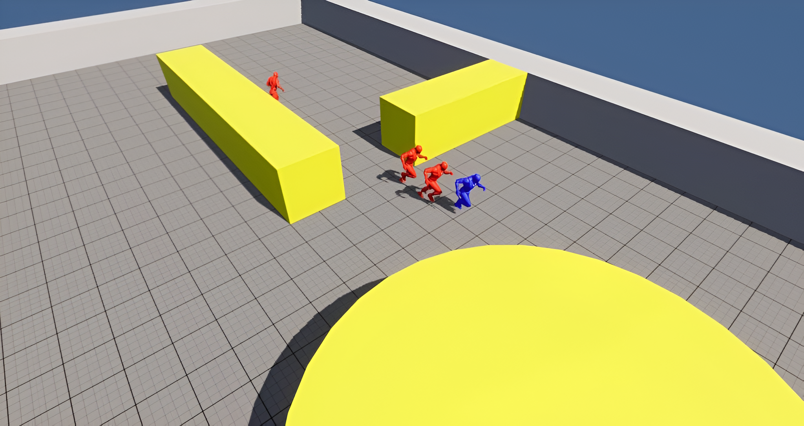
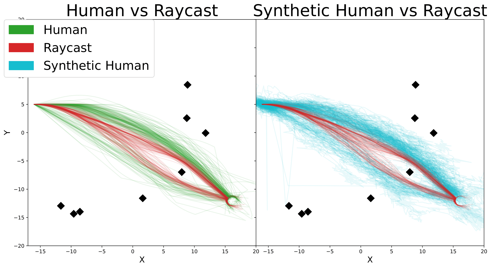
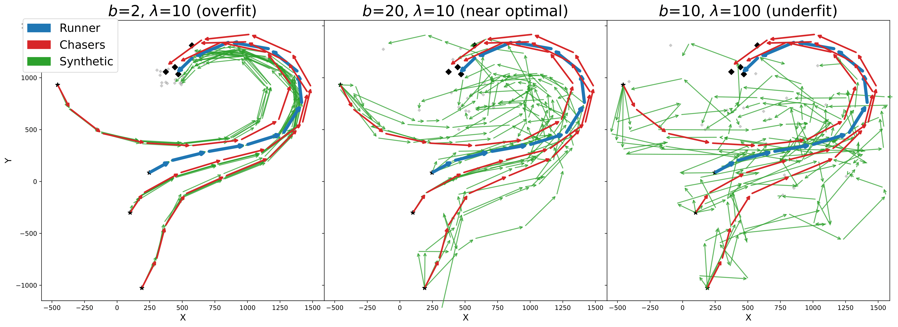
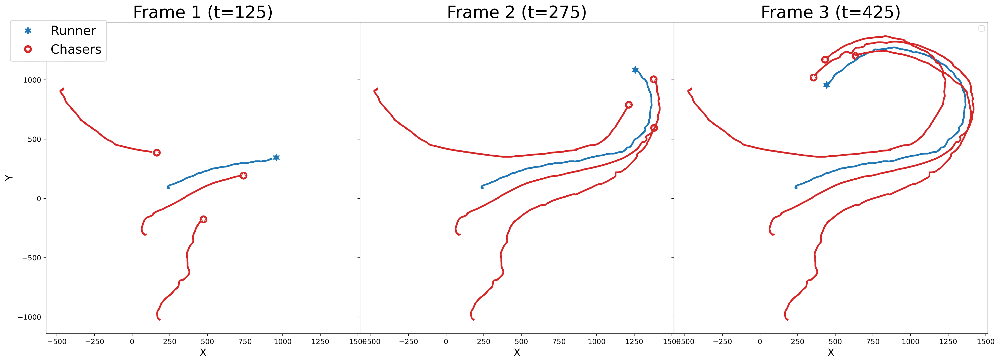
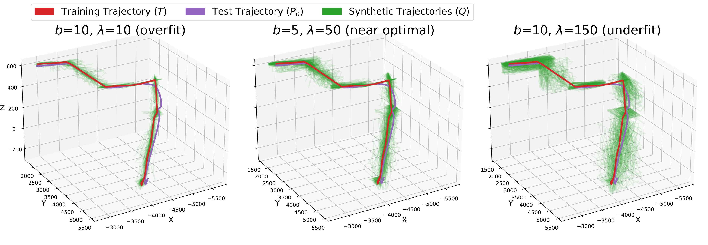

<a id="readme-top"></a>

# Path Generation and Evaluation in Video Games

<!-- PROJECT LOGO -->
<br />
<div align="center">
  <a href="https://github.com/github_username/repo_name">
    
  </a>

<!-- <h3 align="center">Path Generation and Evaluation in Video Games</h3> -->

  <p align="center">
    This repository contains the code used to generate and evaluate synthetic navigation paths via a nonparametric statistical approach (model-free transformation + copula). Below are the key visual results produced by the code.
    <br />
    <a href="https://arxiv.org/abs/2506.03522"><strong>Read the full paper »</strong></a>
  </p>
</div>


---

## Results

### Human vs Raycast vs Synthetic Human

<figure>
  
  <figcaption><strong>Figure 1.</strong> The original data consists of human (green) and raycast-based RL
agents (red) navigating through a 2D obstacle course, with obstacles shown
as black diamonds [14]. Our synthetically generated human trajectories (blue)
are visually more human-like than the raycast agents. We analytically show
this in Section VI using statistical hypothesis testing.</figcaption>
</figure>

### Schola Plugin: Original and Synthetic Paths

<figure>
  
  <figcaption><strong>Figure 7.</strong> Original and Synthetic paths from Schola plugin. Note that original paths are shown in red and blue, starting from stars and ending at diamonds.
Synthetic paths for each case are shown in green (5 for each agent). We see that increasing b or λ increases the variance in the synthetic paths and they
transition from being strongly overfitted to strongly underfitted from left to right. While the middle subplot produces most of its variance towards the end of
the synthetic trajectories, the right subplot produces high variance even at the start. This is likely the reason for the increased CT value observed in Table I.</figcaption>
</figure>

### Schola Sample Frames

<figure>
  
  <figcaption><strong>Figure 8.</strong> Three frames from a synthetically generated episode based on the Schola Tag example. This figure demonstrates that temporal properties are preserved
during our generation process. The trajectories progress over time in a manner that matches the behavior of the paths in the original dataset.</figcaption>
</figure>

### Navigation Turing Test: Original and Synthetic 3D Paths

<figure>
  
  <figcaption><strong>Figure 9.</strong> 50 NTT synthetic generated paths from 3 different parameter sets. In this case too we see that increasing b or λ increases the variance in the synthetic
paths and they transition from being strongly overfitted to strongly underfitted from left to right.</figcaption>
</figure>

---


## Requirements

* Python >= 3.8

Install with:

```bash
pip install -r requirements.txt
```

<!-- CONTACT -->
## Contact

Daniel Campa - [LinkedIn](https://www.linkedin.com/in/danielcampa/) - dc00039@mix.wvu.edu

<!-- Project Link: [https://github.com/github_username/repo_name](https://github.com/github_username/repo_name) -->


<!-- ACKNOWLEDGMENTS -->
## How to Cite

```
@misc{campa2025pathgenerationevaluationvideo,
      title={Path Generation and Evaluation in Video Games: A Nonparametric Statistical Approach}, 
      author={Daniel Campa and Mehdi Saeedi and Ian Colbert and Srinjoy Das},
      year={2025},
      eprint={2506.03522},
      archivePrefix={arXiv},
      primaryClass={cs.LG},
      url={https://arxiv.org/abs/2506.03522}, 
}
```

<p align="right">(<a href="#readme-top">back to top</a>)</p>
